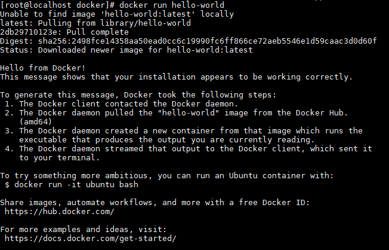

## 配置 docker 镜像仓库

使用 yum-config-manager 命令可以进行 YUM 配置管理。

需要先安装 yum-utils, 才能使用 yum-config-manager 命令

```sh
yum install yum-utils
```

添加阿里云镜像仓库

```sh
yum-config-manager --add-repo https://mirrors.aliyun.com/docker-ce/linux/centos/docker-ce.repo
```

yum 仓库的配置文件存储在/etc/yum.repos.d/ 目录下

```sh
ls /etc/yum.repos.d/
```

查看拥有的仓库

```sh
yum repolist all
```

## 安装 Docker (CE)

```sh
yum install docker-ce docker-ce-cli containerd.io docker-buildx-plugin docker-compose-plugin
```

## 启动 docker 服务

```sh
systemctl start docker
```


## 添加阿里云镜像加速器

<https://cr.console.aliyun.com/cn-hangzhou/instances/mirrors>


## 验证安装是否成功

```sh
docker run hello-world
```



## 官方文档安装 Docker (CE)

docker官网安装部署文档:<https://docs.docker.com/engine/install/centos/>